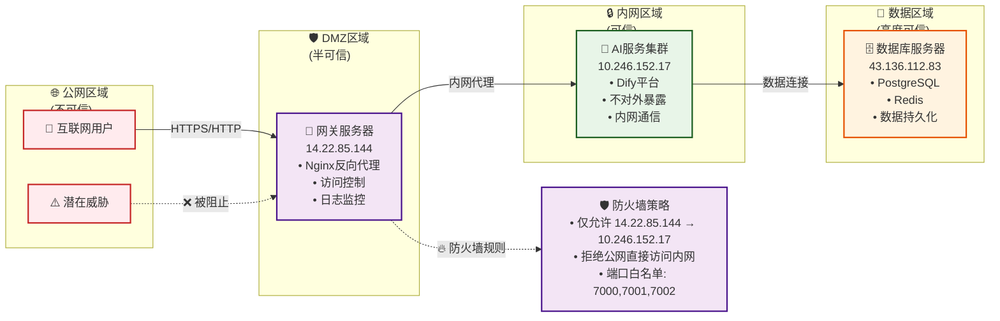

```mermaid
graph LR
    subgraph Public["🌐 公网区域<br/>(不可信)"]
        Users[👥 互联网用户]
        Threats[⚠️ 潜在威胁]
    end
    
    subgraph DMZ["🛡️ DMZ区域<br/>(半可信)"]
        Gateway[🚪 网关服务器<br/>14.22.85.144<br/>• Nginx反向代理<br/>• 访问控制<br/>• 日志监控]
    end
    
    subgraph Private["🔒 内网区域<br/>(可信)"]
        AIServices[🤖 AI服务集群<br/>10.246.152.17<br/>• Dify平台<br/>• 不对外暴露<br/>• 内网通信]
    end
    
    subgraph Data["💾 数据区域<br/>(高度可信)"]
        Databases[🗄️ 数据库服务器<br/>43.136.112.83<br/>• PostgreSQL<br/>• Redis<br/>• 数据持久化]
    end
    
    Users --> |HTTPS/HTTP| Gateway
    Threats -.-> |❌ 被阻止| Gateway
    Gateway --> |内网代理| AIServices
    AIServices --> |数据连接| Databases
    
    %% 防火墙规则
    Gateway -.-> |🔥 防火墙规则| FWRules["🛡️ 防火墙策略<br/>• 仅允许 14.22.85.144 → 10.246.152.17<br/>• 拒绝公网直接访问内网<br/>• 端口白名单: 7000,7001,7002"]
    
    classDef publicClass fill:#ffebee,stroke:#c62828,stroke-width:2px
    classDef dmzClass fill:#f3e5f5,stroke:#4a148c,stroke-width:2px
    classDef privateClass fill:#e8f5e8,stroke:#1b5e20,stroke-width:2px
    classDef dataClass fill:#fff3e0,stroke:#e65100,stroke-width:2px
    
    class Users,Threats publicClass
    class Gateway,FWRules dmzClass
    class AIServices privateClass
    class Databases dataClass
```