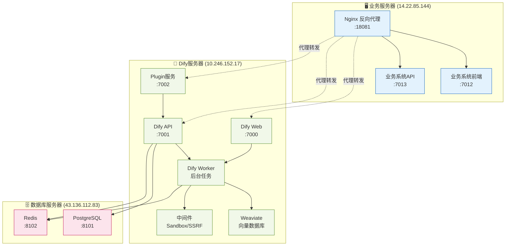

```mermaid
graph TD
    subgraph "🖥️ 业务服务器 (14.22.85.144)"
        A[Nginx 反向代理<br/>:18081] --> B[业务系统前端<br/>:7012]
        A --> C[业务系统API<br/>:7013]
    end
    
    subgraph "🤖 Dify服务器 (10.246.152.17)"
        D[Dify Web<br/>:7000] --> G[Dify Worker<br/>后台任务]
        E[Dify API<br/>:7001] --> G
        F[Plugin服务<br/>:7002] --> E
        G --> H[Weaviate<br/>向量数据库]
        G --> I[中间件<br/>Sandbox/SSRF]
    end
    
    subgraph "🗄️ 数据库服务器 (43.136.112.83)"
        J[PostgreSQL<br/>:8101]
        K[Redis<br/>:8102]
    end
    
    %% 连接关系
    A -.->|代理转发| D
    A -.->|代理转发| E  
    A -.->|代理转发| F
    E --> J
    E --> K
    G --> K
    
    %% 样式
    classDef business fill:#e3f2fd,stroke:#1565c0
    classDef dify fill:#f1f8e9,stroke:#558b2f
    classDef database fill:#fce4ec,stroke:#c2185b
    
    class A,B,C business
    class D,E,F,G,H,I dify
    class J,K database
```