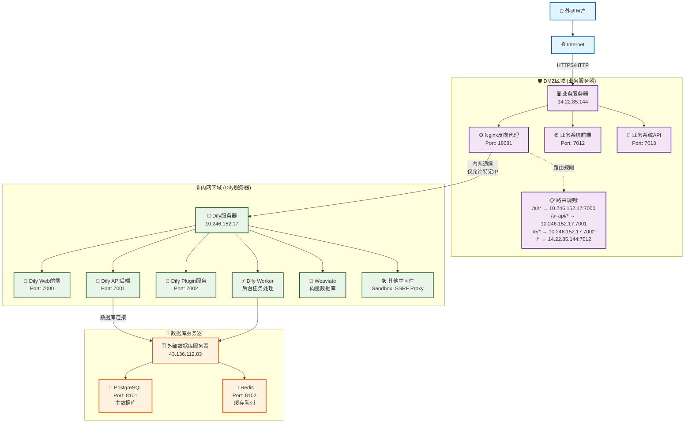

```mermaid
graph TB
    %% 外网用户层
    User[👤 外网用户] --> Internet[🌐 Internet]
    
    %% 业务服务器 (DMZ区域)
    Internet --> |HTTPS/HTTP| BusinessServer[🖥️ 业务服务器<br/>14.22.85.144]
    
    subgraph DMZ["🛡️ DMZ区域 (业务服务器)"]
        BusinessServer --> Nginx[⚙️ Nginx反向代理<br/>Port: 18081]
        BusinessServer --> WebFront[🌐 业务系统前端<br/>Port: 7012]
        BusinessServer --> WebAPI[🔌 业务系统API<br/>Port: 7013]
        
        Nginx -.->|路由规则| Routes["📋 路由规则:<br/>/ai/* → 10.246.152.17:7000<br/>/ai-api/* → 10.246.152.17:7001<br/>/e/* → 10.246.152.17:7002<br/>/* → 14.22.85.144:7012"]
    end
    
    %% 内网连接
    Nginx --> |内网通信<br/>仅允许特定IP| DifyServer[🤖 Dify服务器<br/>10.246.152.17]
    
    %% Dify服务器 (内网区域)
    subgraph IntraNet["🔒 内网区域 (Dify服务器)"]
        DifyServer --> DifyWeb[🎨 Dify Web前端<br/>Port: 7000]
        DifyServer --> DifyAPI[🔧 Dify API后端<br/>Port: 7001]
        DifyServer --> DifyPlugin[🧩 Dify Plugin服务<br/>Port: 7002]
        DifyServer --> DifyWorker[⚡ Dify Worker<br/>后台任务处理]
        DifyServer --> Weaviate[🧠 Weaviate<br/>向量数据库]
        DifyServer --> Middleware[🛠️ 其他中间件<br/>Sandbox, SSRF Proxy]
    end
    
    %% 外部数据库
    DifyAPI --> |数据库连接| DBServer[🗄️ 外部数据库服务器<br/>43.136.112.83]
    DifyWorker --> DBServer
    
    subgraph Database["💾 数据库服务器"]
        DBServer --> PostgreSQL[🐘 PostgreSQL<br/>Port: 8101<br/>主数据库]
        DBServer --> Redis[🔴 Redis<br/>Port: 8102<br/>缓存队列]
    end
    
    %% 样式定义
    classDef userClass fill:#e1f5fe,stroke:#01579b,stroke-width:2px
    classDef dmzClass fill:#f3e5f5,stroke:#4a148c,stroke-width:2px
    classDef intraClass fill:#e8f5e8,stroke:#1b5e20,stroke-width:2px
    classDef dbClass fill:#fff3e0,stroke:#e65100,stroke-width:2px
    
    class User,Internet userClass
    class BusinessServer,Nginx,WebFront,WebAPI,Routes dmzClass
    class DifyServer,DifyWeb,DifyAPI,DifyPlugin,DifyWorker,Weaviate,Middleware intraClass
    class DBServer,PostgreSQL,Redis dbClass
```